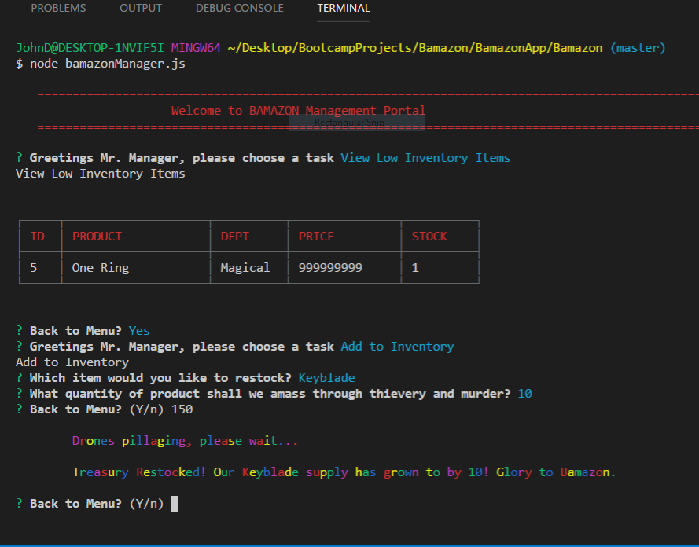

# Bamazon
***
    Command line shopping app made with node.js and mySQL. 

## Customer View
***    
    * As a customer, the user can see a table of available products. The user selects the product they wish to purchase as well as the quantity. Bamazon updates the products table and informs the user of their total.

## Manager View
***
    * As a manager, the user can choose from the following options:
    **View Products For Sale
    **View Low Inventory Items
    **Add to Inventory
    **Add New Product
  
